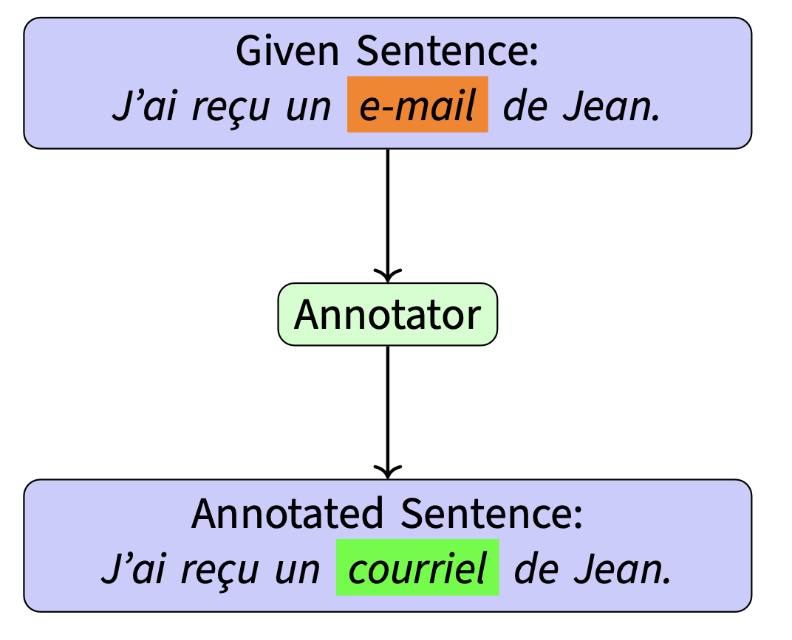

# Loanwords Annotation Task

---

For more information about the task, see the [slides](https://sinaahmadi.github.io/docs/slides/Loanwords_annotation_slides.pdf) (or [handout](https://sinaahmadi.github.io/docs/slides/Loanwords_annotation_handout.pdf)) of the plenary meeting.

---

<p align="center">
    
</p>

The goal of this project is to create a contrastive dataset where in a given sentence loanwords are replaced by native alternatives. To do so, we use the CLoAn toolkit. This guide provides essential information about the annotation task and the tool.


## Installing CLoAn

To use _CLoAn_, clone this repository in a directory of your choice:

```bash
    git clone git@github.com:chamisshe/CLoAn.git
```

Next, you'll want to run the included setup-scripts. This will create a virtual environment, install the required packages and create the necessary folder structure.

    
**Mac/Linux**

On a UNIX-based system, run the following commands:
    
```bash
    cd CLoAn
    source setup.sh
```

**Windows**

On Windows (CMD or PowerShell), run:
    
```powershell
    cd CLoAn
    setup.bat
```

#### Installing the Flores+ dataset
You will most likely will work with the `devtest` split of the **FLORES+** dataset. We cannot host the dataset on a public repository, therefore you will have to download the dataset from it's [source repository](https://github.com/openlanguagedata/flores?tab=readme-ov-file#download-the-dataset) yourself.<br>
**Important:** Keep track of the path where you stored it, as you'll need to tell _CLoAn_ when you use the tool for the first time.


## Using CLoAn
Once you've installed the tool, you'll want to run it. Since it relies on a number of Python-modules, make sure you're running it inside the proper virtual environment.

###### Activating the venv 

    
**Mac/Linux**

On a UNIX-based system such as Linux or MacOS, run the following script:

```bash
source activate.sh
```

**Windows**

On Windows, run:

```powershell
.\activate.bat
```

All these commands do is activate the Virtual Environment and move into the directory where the relevant scripts are stored (it's just two simple lines of code, but we're all about that convenience).

##### Regular Startup

Run the script from your terminal of choice.

`python activate.py` / `python3 activate.py`

You will then be presented with an interactive menu to guide you through the startup.<br>

###### Corpus selection

In a first step, you'll have to choose the corpus you're annotating. This will most likely be `FLORES+devtest`. Since it's the default, _CLoAn_ already knows about both `FLORES+devtest` and `FLORES+dev`.<br>
The first time you try to annotate any corpus, _CLoAn_ will need to know where to find the relevant files. You'll be asked to enter the path to the directory where **all** the corpus' files can be found.


**Example**

Let's say the FLORES+ dataset is stored in the following directory:<br>`C:/Users/Gimli/Documents/floresp-v2.0-rc.2`

It will contain two subdirectories, `dev` and `devtest`:

```powershell
floresp-v2.0-rc.2
├───dev
└───devtest
```

When prompted for the path of `FLORES+devtest`, you'll have to paste `C:/Users/Gimli/Documents/floresp-v2.0-rc.2/devtest`, as this is where all the files are stored. Let's call this the `<corpus_path>` for the remainder of this guide.


CLoAn remembers the (correct) path to the corpus for later usage.


###### Select Language

Next, you'll need to select the language you want to annotate.

Different corpora might use different naming schemes. Thus, _CLoAn_ needs to remember the specific filename for each corpus-language combination. For a few languages, where we anticipate annotation, the filenames are already stored.

If you're choosing a different language (`> Other`), _CLoAn_ will ask for the filename, which we'll call `<filename>`. 


**Example**

Let's say you want to annotate the FLORES+devtest corpus in _Sindarin_:

If FLORES+ had any resources in Sindarin (a fictional language in Tolkien's Middle-earth), they would be stored in the following file:<br>`devtest.sjn_Teng`

Let's break this down:
- `devtest` is the name of the subset (split). All filenames in FLORES+devtest start with it. the filename
- `sjn` is the language code according to [ISO-639-3](https://iso639-3.sil.org/code_tables/639/data)
- `Teng` is the code for the script the resources are written in according to [ISO-15924](https://en.wikipedia.org/wiki/ISO_15924)

_CLoAn_ will then try to open find the file `<corpus_name>/<filename>`.<br>In our series of examples, this would be `C:/Users/Gimli/Documents/floresp-v2.0-rc.2/devtest/devtest.sjn_Teng`. This will look different for you, because **A.** you've stored it under a different directory (your username probably isn't Gimli) and **B.** you're not going to be annotating Sindarin.


Most languages have multiple names (e.g. _Finnish_/_Suomi_). We want to make sure that _CLoAn_ uses the same name for each language consistently. When adding a new language to a corpus, you'll be shown all language-names known to _CLoAn_ so far. If your language is present in this list, you should select it, otherwise you can the name for your \"new\" language.

##### Fast Startup

You can skip the extensive startup-menu by providing the name of both the corpus and the language when you call the program.<br>

To do so, you need to use the appropriate flags:
- `-l`/`--language` for the language
- `-c`/`--corpus` for the corpus


**Example**

```bash
python annotate.py -c FLORES+devtest -l Sindarin
```


If _CLoAn_ can find all the necessary files and configuration parameters, this will take you directly to the annotation. Otherwise, you might be asked to provide additional information such as paths and filenames.

## Hotkeys

### Navigating _CLoAn_

You can navigate all of _CLoAn_ using simply your keyboard, in fact your mouse won't be of much use here.<br>

##### Interrupting/Exiting

To **interrupt** _CLoAn_, press `CTRL + C`. <br> This raises what's called a _KeyboardInterrupt_. This is one of Python's built-in ways of letting the user stop the execution of a script.<br><br> 
In most cases, this should bring up a menu with various options of what to do next.

##### Menus

To navigate up and down between multiple options in the menus, use either
- the arrow keys (`up`/`down`)
- _vim_-style navigation: (`j` - down; `k` - up)

###### Select

In menus where you have to choose a single option (including Interrupt-menus), each item should have a number in front of itself. Pressing said number on your keyboard will take you directly to this item. 

The current item will be highlighted in magenta/purple.<br>
To select the current item, press enter.

###### Checkbox

In menus where you may want to select multiple options, you can **select/unselect** an item by pressing `SPACE`. By default, all items are unselected. Once you've selected the items you want, press `ENTER`.


## Annotation

<p align="center">
    
</p>

Once you install the tool and familize with the functionalities, you can start the annotation task. The final data in each language consists of sentence-pairs. In each pair, sentence _A_ will contain loanwords, while sentence _B_ will be the same sentence, but (ideally) have all its **loanwords replaced by native alternatives**.

| A: including loanwords                 | B: excluding loanwords                       |
|----------------------------------------|----------------------------------------------|
| He bought himself a new *rucksack*.      | He bought himself a new *backpack*.            |
| I lost sight of *doppelgänger en route*. | I lost sight of *look-alike along the way*. |
| Που έχει αυτή την *κουλτούρα* ... | Που έχει αυτό τον *πολιτισμό* ...  |


The annotation process is split into two parts:
1. **Marking (first pass)<br>**
2. **Modification (second pass):<br>**

#### 1. Marking

You'll go through each sentence of your target language in the corpus. For now, we're just interested in collecting 3 pieces of information _about_ each sentence:
- Does it contain any **obvious and replaceable** loanwords?
- Does it contain any **Named Entities**?
- Does it contain any instances of **foreign-script items**?
You'll be presented with a multi-select menu. You can navigate it with the arrow-keys or \<j\> & \<k\> (\<j\>=down, \<k\>=up). To select/unselect an item, use the space-bar. Once you're done, press ENTER.

**Note:** There might be some strange and unexpected characters (`@`) in your sentence. You need not worry about this. To flag loanwords more effectively, sentences are tokenized first. These additional symbols are used to put the sentence back together when it is stored in the final output. Just ignore these special characters.

**WARNING:** You can only move forward through the corpus. Once you've made your choice, you can't go back to change your answers.
<!-- check -->

###### Named Entites²

Named entities can be:
- people (e.g. _Dr. Ehud Ur_, _Thorin Oakenshield_)
- places (_Nova Scotia_, _Halifax_, _Rivendell_)
- organisations/companies (_Dalhousie University_, _Canadian Diabetes Association_, _ADT corporation_)
- others: products/services (_Gmail_, _Linux_), events (_October Revolution_), medical terms (_Malaria_), etc.

Named entities can often be foreign or borrowed words, but because of their referential function often cannot be  replaced by more native alternatives. However, some named entities may be partly or completely translated into a target language (English to German in the following examples):
- _United States_ → _Vereinigte Staaten_
- _Dengue fever_ → _Dengue Fieber_
- _Harvard University_ → _Universität Harvard_

**If the current sentence contains any named entities, mark it as such.**

###### Foreign Script

Relatively self-explanatory: Any instances of writings in foreign script. This will likely be more relevant for any annotation in non-Latin script.

The following is an example of a sentence from the Central-Kurdish file of FLORES+devtest:<br>
_لە کۆتایی ٢٠١٧ دا، سیمینۆف لە کەنالی تەلەڤیزۆنیی بازاڕکردندا بەناوی (QVC) دەرکەوت._

You can see the abbreviation in Latin script, whereas the rest of the sentence is written in Arabic script.<br>**If such an instance of "script-switching" occurs in the current sentence, mark it accordingly.**


#### 2. Modification

After having gone through the whole corpus, _CLoAn_ will load all the sentences you marked as containing _obvious and replaceable loanwords_.

Your task now is to modify the sentences such that (where possible) all loanwords are replaced by native alternatives. _CLoAn_ does this in multiple substeps

##### Replace detected loanwords

In those languages where lists of known loanwords are available, the potential loanwords (= _candidates_) of each sentence will be flagged. 

For each of the candidates, you'll be presented with various options:
- `-SKIP LOANWORD-`: Do not replace the current word, leave it as is. Mostly when _A._ the candidate is not a loanword, or _B._ there is no adequate alternative
- `-CUSTOM INPUT-`: Replace it with a custom word.
- `-DISCARD SENTENCE ALTOGETHER-`: Skip the whole sentence, do **not save** any of it (including previous replacements!)

For some languages, _CLoAn_ is able to automatically suggest some alternatives. These will then also show up in the same menu.
- `Alternative 1`: The first alternative
- `Alternative 2`: The second alternative
- `...`


###### Option: `-CUSTOM INPUT-`

Here are some more details on how things work when you choose the `-CUSTOM INPUT-` option.

1. You will be asked to enter the selected alternative for the current candidate in its **lemma-form**.
<br> _CLoAn_ then does two things:
    - Internally, the candidate and the proposed alternative are stored in the _annotation-memory_. When you encounter the same loanword candidate again later, your custom alternative will be among the suggestions.
    - The sentence is modified: The candidate is replaced by the alternative.
2. Next, the modified sentence is pasted to the console. You can now edit the whole sentence to ensure it's well-formed and grammatical.<br>When you're finished, press ENTER.

##### Manual Replacement

Because the automatic detection **won't** catch all loanwords, you also have the option to replace words that haven't been flagged.

To keep track of all the replacements we make, manual replacement works in three consecutive steps:
1. Delete the loanword you want to replace. 
2. Enter the alternative (preferrably in lemma-form) in the appropriate place.
3. Edit the sentence to ensure it stays grammatical.


**Example**

Goal: Replace _suave_ by _smooth_

Original sentence: <br>`I was convinced by a very suave salesman.` <br><br> → delete _suave_:<br>`I as convinced by a very  salesman.` <br><br> → insert _smooth_:<br>`I was convinced by a very smooth salesman.` <br><br> → edit (not necessary in this case):<br>`I was convinced by a very smooth salesman.`<br>

From now on, whenever _suave_ shows up in a sentence, _CLoAn_ will suggest _smooth_ as an alternative.


You can do multiple replacements in a given sentence.

### Results

The results will be stored in the following JSON-file:

```CLoAn/data/output/OUT_<corpus>_<language>.json```

For each modified sentence, it will store the original and the modified version of the sentence as strings. Additionally, the replacement operations made in each sentence are stored as a dictionary (`{loanword : alternative}`). The sentences themselves are indexed by their position in the corpus.
